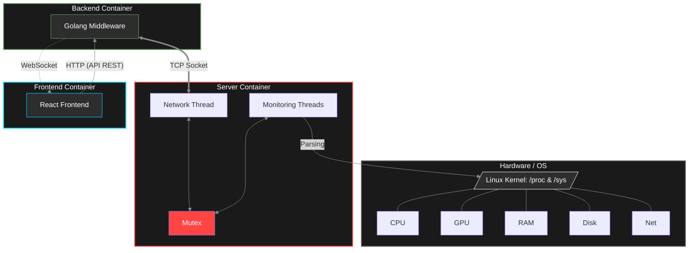

Real-Time Telemetry System

```mermaid
%%{init: {'themeVariables': { 'lineColor': '#888'}}}%%
graph TD
    subgraph Hardware [Hardware / OS]
        Kernel[/Linux Kernel: /proc & /sys/]
        CPU
        GPU
        RAM
        Disk
        Net
        %% Conexão interna do Hardware
        Kernel --- CPU
        Kernel --- GPU
        Kernel --- RAM
        Kernel --- Disk
        Kernel --- Net
    end

    subgraph C_Server [Server Container]
        direction TB
        NetThread[Network Thread]
        Mutex[Mutex]
        MonThreads[Monitoring Threads]
        
        NetThread <---> Mutex
        MonThreads <---> Mutex
    end

    subgraph Backend [Backend Container]
        Go[Golang Middleware]
    end

    subgraph Client [Frontend Container]
        React[React Frontend]
    end

    %% Conexões Externas
    MonThreads -- "Parsing" --> Kernel
    React -- "HTTP (API REST)" --> Go
    Go -. "WebSocket" .-> React
    Go <== "TCP Socket" ==> NetThread

    %% Estilização de Contêineres
    style Hardware fill:#1a1a1a,stroke:#555,stroke-width:2px,color:#fff
    style Kernel fill:#2d2d2d,stroke:#fff,color:#fff
    style C_Server fill:#1a1a1a,stroke:#ff4444,stroke-width:2px,color:#fff
    style Mutex fill:#ff4444,color:#fff
    style Backend fill:#1a1a1a,stroke:#68a063,stroke-width:2px,color:#fff
    style Go fill:#2d2d2d,stroke:#68a063,color:#fff
    style Client fill:#1a1a1a,stroke:#00d8ff,stroke-width:2px,color:#fff
    style React fill:#2d2d2d,stroke:#00d8ff,color:#fff
```