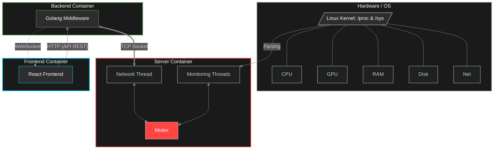
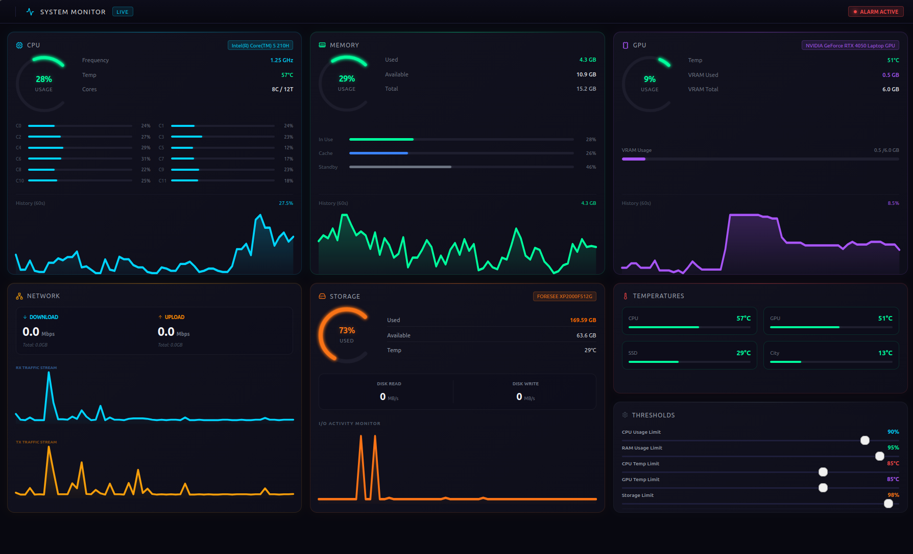

# RT-TELEMETRY-DASHBOARD

A distributed, event-driven real-time telemetry system designed for low-latency collection, processing, and visualization of hardware metrics using a custom C-based collector, a Go backend, and a WebSocket-driven React dashboard.

---

## System Architecture

The system separates data collection (C), processing (Go), and visualization (React) to optimize for performance, scalability, and fault isolation.



### Components
1. **Server Container (C):** The C server collects kernel metrics via /proc and streams structured telemetry over TCP to the Go backend, which aggregates and broadcasts updates via WebSocket to the React client.

2. **Backend Container (Go):** Acts as the central nervous system. Connects via TCP to the C server, manages application state with an internal event Hub, and exposes WebSockets and a REST API to the client.

3. **Frontend Container (React):** A responsive, slick dashboard UI that streams real-time data using WebSockets for instantaneous chart rendering.

### Tech Stack

- C (low-level metrics collector)
- Go (backend middleware, WebSocket hub, REST API layer)
- React (frontend)
- WebSocket + TCP + API REST
- Docker / Docker Compose

---

## Key Features

- Real-time hardware telemetry (CPU, GPU, RAM, Disk, Network)
- Low-latency streaming pipeline
- Multi-container distributed architecture
- WebSocket-based live dashboard updates
- Kernel-level data collection via /proc and /sys

## User Interface

The dashboard provides a comprehensive, single-page monitoring interface designed with a modern, high-contrast dark theme for optimal readability:



---

## Getting Started

### Prerequisites

- Docker and Docker Compose installed.

- Appropriate read permissions on the host system (so the monitoring container can parse /proc files accurately).

### Installation & Run

1. **Clone the repository:**
```bash
git clone https://github.com/LucasM4r/RT-TELEMETRY-DASHBOARD.git
cd RT-Telemetry-Dashboard
```
2. **Boot the environment using the Makefile:**
```bash
make run
```

Alternatively, using standard Docker Compose:

```bash
docker compose up --build
```

[](https://doi.org/10.5281/zenodo.20364557)