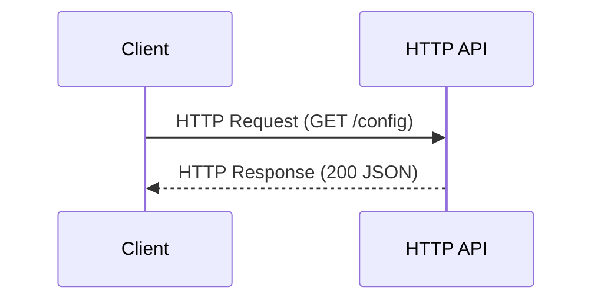

# APPLICATION PROGRAMMING INTERFACE (API)

This package is responsible for the HTTP layer of the application.

It exposes REST endpoints, handles HTTP requests, performs basic validation, and delegates all business logic and external communication to lower layers such as `bridge` and `tcp`.

[RFC 9110: STD 97: HTTP Semantics](https://www.rfc-editor.org/info/rfc9110/)

[RFC 9111: STD 98: HTTP Caching](https://www.rfc-editor.org/info/rfc9111/)

[RFC 9114: HTTP/3](https://www.rfc-editor.org/info/rfc9114/)
---

## HTTP Overview

This API layer is built on top of the HTTP protocol, which follows a request–response model between a client and a server.

HTTP operates at the Application Layer (OSI Layer 7) and runs over the TCP protocol (Transport Layer 4), which provides reliable, ordered delivery of data.

Each HTTP request contains:
- HTTP method (GET, POST, etc.)
- Path (endpoint)
- Headers
- Optional body

Each HTTP response contains:
- Status code (e.g. 200, 400, 500)
- Headers
- Response body (JSON)

---

## Status Codes

- 200 OK → Successful request
- 400 Bad Request → Invalid input
- 404 Not Found → Invalid route
- 405 Method Not Allowed → Wrong HTTP method
- 500 Internal Server Error → External dependency failure (e.g. C server unreachable)

---

## HTTP Message Breakdown

An HTTP message is composed of three main parts:

| Part         | Description                     | Example                                  | Size Behavior        |
|--------------|---------------------------------|------------------------------------------|----------------------|
| Request Line | Method + Path + Version         | `GET /config HTTP/1.1`                   | ~16–30 bytes         |
| Headers      | Key-value metadata              | `Content-Type: application/json`        | Variable (20B–200B+) |
| Body         | Payload (optional JSON data)    | `{"target":"cpu","value":80}`           | Variable             |

---

## Example HTTP Request

GET /config HTTP/1.1
Host: localhost:5000
Content-Type: application/json
User-Agent: telemetry-client

{"target":"cpu","value":80}

---

## Estimated Payload Size Formula

Total Size ≈ Request Line + Headers + Body + Overhead

Where:
- Request Line = method + path + version
- Headers = sum of all key-value pairs
- Body = serialized JSON size
- Overhead = CRLF characters (\r\n) + HTTP formatting

---

## Important Notes

- HTTP is a text-based protocol
- Each character is typically 1 byte in ASCII/UTF-8 (not always true for extended characters)
- Real payload size depends on:
  - number of headers
  - JSON structure
  - encoding (UTF-8 may use multiple bytes per character)