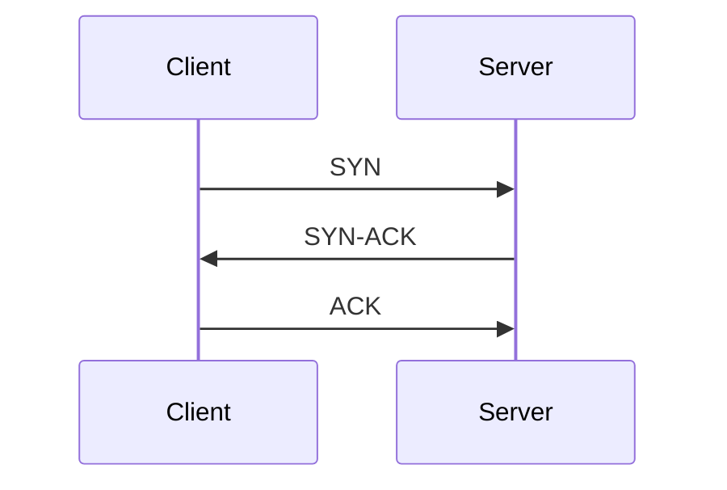
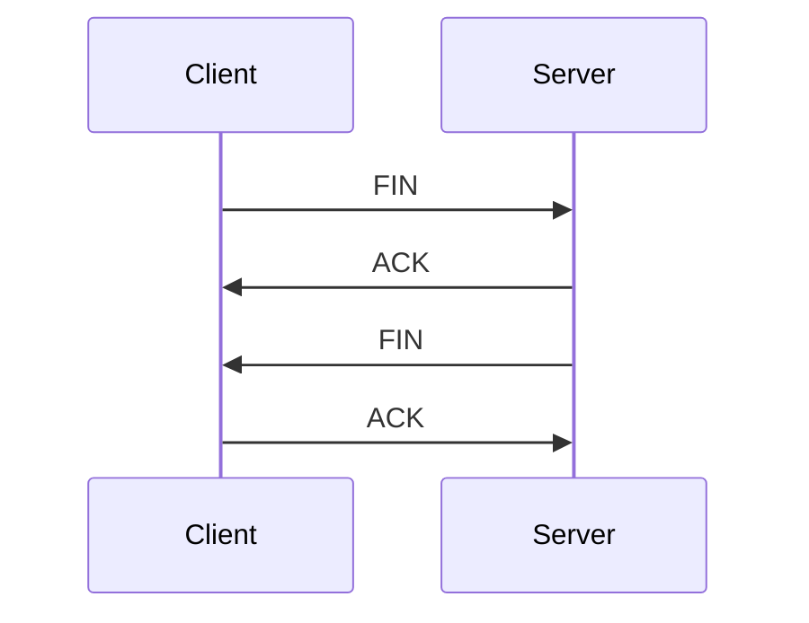

# Transmission Control Protocol (TCP)

TCP operates at the Transport Layer (Layer 4) of the OSI (Open Systems Interconnection) model.

It provides reliable, ordered, and error-checked communication between applications running on different devices across a network, even under unstable network conditions.

TCP was chosen because it provides:

- reliable delivery
- ordered transmission
- connection-oriented communication

## Connection Establishment (Three-Way Handshake)

TCP connections are established using a three-way handshake.



- **SYN (Synchronize):** The client sends a SYN segment to the server to request a connection.

- **SYN-ACK (Synchronize-Acknowledge):** The server responds with a SYN-ACK segment, acknowledging the request and accepting the connection.

- **ACK (Acknowledge):** The client replies with an ACK segment, confirming and establishing the connection.

## Connection Termination (Four-Way Handshake)

TCP connections are terminated using a four-way handshake.

- **FIN (Finish) from Client:** The client sends a FIN segment to the server, indicating that it has finished sending data.

- **ACK (Acknowledge):** The server acknowledges the FIN with an ACK segment.

- **FIN (Finish) from Server:** The server sends its own FIN segment to close its side of the connection.

- **ACK (Acknowledge):** The client responds with a final ACK segment, completing the connection termination.



## TCP Header

TCP uses a header to manage reliable communication between devices.

The TCP header contains important control information such as:

- **Source Port:** Identifies the sending application.
- **Destination Port:** Identifies the receiving application.
- **Sequence Number:** Keeps track of byte ordering.
- **Acknowledgment Number:** Confirms received data.
- **Flags:** Control connection behavior (`SYN`, `ACK`, `FIN`, etc.).
- **Window Size:** Controls flow regulation between sender and receiver.
- **Checksum:** Detects transmission errors.

These fields allow TCP to provide reliable and ordered communication over the network.

## TCP Header Structure

| Order | Field | Size | Description |
|---|---|---|---|
| 1 | Source Port | 16 bits | Identifies the sending application |
| 2 | Destination Port | 16 bits | Identifies the receiving application |
| 3 | Sequence Number | 32 bits | Tracks byte ordering |
| 4 | Acknowledgment Number | 32 bits | Confirms received data |
| 5 | Data Offset | 4 bits | Indicates the TCP header size |
| 6 | Reserved | 6 bits | Reserved for future use |
| 7 | Flags | 9 bits | Controls connection state (`SYN`, `ACK`, `FIN`, etc.) |
| 8 | Window Size | 16 bits | Controls flow regulation |
| 9 | Checksum | 16 bits | Detects transmission errors |
| 10 | Urgent Pointer | 16 bits | Indicates urgent data |
| 11 | Options | Variable | Optional TCP configuration fields |

## Stream-Oriented Communication

TCP is a stream-oriented protocol, meaning that data is transmitted as a continuous stream of bytes rather than discrete messages.

Because TCP does not preserve message boundaries, this project uses newline-delimited messages (`\n`) to separate commands and telemetry payloads.

## Project Communication Flow

The Go backend connects to the telemetry server over TCP and continuously receives real-time telemetry data.

## Application Protocol

The application protocol is built on top of TCP using newline-delimited messages.

The Go backend communicates with the telemetry server using text commands followed by JSON payload responses.

Each message is separated using a newline character (`\n`).

## Command Format

Commands are transmitted as UTF-8 encoded strings.

Example:

```text
STREAM\n
```

The telemetry server listens for commands and responds with real-time telemetry payloads.

## Telemetry Payload Format

Telemetry data is transmitted as JSON payloads over the TCP stream.

Example payload:

```json
{
  "cpu": 32.5,
  "cpu_temp": 61.2,
  "mem_usage": 48.1,
  "gpu_temp": 54.0
}
```

## Message Decoding

The Go backend uses a generic decoder to deserialize JSON payloads into strongly typed Go structs.

```go
func Decode[T any](data []byte) (T, error) {
	var result T

	if err := json.Unmarshal(data, &result); err != nil {
		return result, err
	}

	return result, nil
}
```

This allows the backend to safely decode telemetry payloads into different message types such as:

- `Metrics`
- `Info`
- `Config`

## Typed Telemetry Structures

The protocol defines multiple structured payload types for real-time monitoring and system configuration.

### Metrics

Real-time telemetry metrics:

- CPU usage and temperature
- Memory usage
- GPU metrics
- Network throughput
- Storage statistics

### Info

Static system information:

- CPU model
- GPU model
- Total memory
- Storage model

### Config

Alert configuration limits for telemetry monitoring.