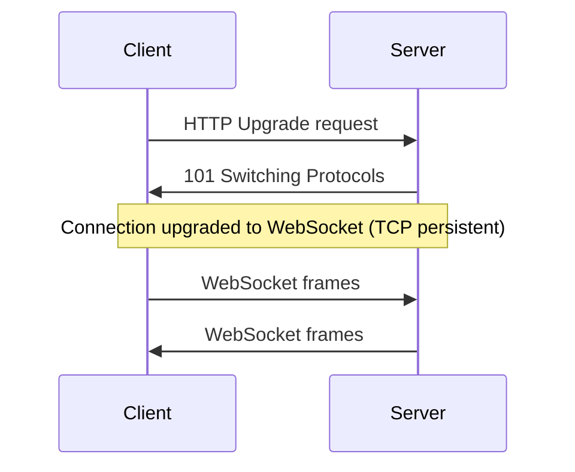

# WebSocket Protocol

WebSocket is a full-duplex communication protocol that operates over a single long-lived TCP connection established via an HTTP Upgrade handshake.

Unlike raw TCP streams, WebSocket provides a **message-based abstraction**, meaning data is exchanged in discrete frames rather than a continuous byte stream.

This project implements a **low-level WebSocket server in Go**, without external libraries, including manual handshake and frame parsing.

[RFC 6455: The WebSocket Protocol](https://www.rfc-editor.org/info/rfc6455/)

---

## Why WebSocket

WebSocket was chosen because it provides:

- Full-duplex communication (bidirectional)
- Persistent long-lived connection
- Low latency real-time messaging
- Native browser compatibility
- Built-in message framing (no need for `\n` delimiters)

---

## Connection Establishment (HTTP Upgrade)

WebSocket starts as a standard HTTP request and is upgraded to a persistent TCP connection.

    
## Upgrade Handshake

The server manually parses the HTTP request and generates the handshake response.

### Client Request:

```text
GET /ws HTTP/1.1
Host: server
Upgrade: websocket
Connection: Upgrade
Sec-WebSocket-Key: ...
Sec-WebSocket-Version: 13
```

### Server Response:

```text
HTTP/1.1 101 Switching Protocols
Upgrade: websocket
Connection: Upgrade
Sec-WebSocket-Accept: ...
```

## Accept Key Generation

The Sec-WebSocket-Accept is computed using SHA-1 + Base64:

```Go
func generateAccept(key string) string {
	h := sha1.New()
	h.Write([]byte(key + websocketGUID))
	return base64.StdEncoding.EncodeToString(h.Sum(nil))
}
```

## WebSocket Frame Model (RFC 6455)

After the handshake, communication happens through frames over TCP.
Each frame contains control information + payload data.

---

## WebSocket Frame Header Structure

| Order | Field | Size | Description |
|------|------|------|-------------|
| 1 | FIN | 1 bit | Indicates if this is the final frame of a message |
| 2 | RSV1 | 1 bit | Extension bit (reserved) |
| 3 | RSV2 | 1 bit | Extension bit (reserved) |
| 4 | RSV3 | 1 bit | Extension bit (reserved) |
| 5 | Opcode | 4 bits | Defines frame type (text, binary, close, ping, pong) |
| 6 | MASK | 1 bit | Indicates if payload is masked (client → server always masked) |
| 7 | Payload Length | 7 bits / 16 bits / 64 bits | Length of the payload data |
| 8 | Masking Key | 0 or 4 bytes | Used to unmask payload data (if MASK = 1) |
| 9 | Payload Data | Variable | Actual message content (application data) |

---

## WebSocket Frame Types (Opcode)

| Opcode | Meaning |
|--------|--------|
| 0x1 | Text frame |
| 0x2 | Binary frame |
| 0x8 | Connection close |
| 0x9 | Ping |
| 0xA | Pong |

---

## Control Frames

WebSocket supports built-in control frames:

- **Ping (0x9):** keep-alive check
- **Pong (0xA):** response to ping
- **Close (0x8):** graceful shutdown of connection

## Key Differences from TCP Header

- TCP header is fixed and handled by the transport layer
- WebSocket frame header is defined at the application layer
- WebSocket runs over TCP (it does not replace it)
- WebSocket introduces message framing on top of a byte stream

---

## Connection Lifecycle

1. HTTP Upgrade handshake
2. Connection established
3. `readLoop` receives frames
4. `writeLoop` sends frames
5. Hub broadcasts messages
6. Connection closed (client or server)

## Implementation Notes (Go)

This project does not use external WebSocket libraries.

Instead, it implements:

- Manual HTTP Upgrade parsing
- Sec-WebSocket-Accept generation (SHA-1 + Base64)
- Frame decoding (`readFrame`)
- Frame encoding (`writeFrame`)
- Concurrency model using a Hub

### Core Flow

- `HandleWS()` → handshake
- `readLoop()` → incoming messages
- `writeLoop()` → outgoing messages
- `Hub` → broadcast layer


---

## Message Flow

1. Client connects via HTTP Upgrade
2. Server validates Sec-WebSocket-Key
3. Connection upgraded to WebSocket
4. Client sends frames
5. Server parses frames (`readFrame`)
6. Hub broadcasts message
7. Server writes frames (`writeFrame`)


## Backpressure Handling

Each client uses a buffered channel (size 256) to prevent slow consumers from blocking the broadcast pipeline.

This ensures:

- Non-blocking hub broadcasts
- Isolation between clients
- Controlled memory usage

## Why Custom Implementation

This project implements WebSocket manually instead of using libraries like `gorilla/websocket` in order to:

- Understand RFC 6455 at frame level
- Implement raw TCP + HTTP upgrade logic
- Control performance and memory behavior
- Build a minimal dependency networking layer